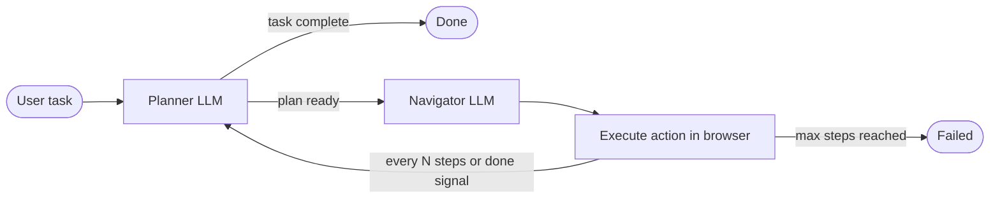

<h1 align="center">
    <br>
</h1>

<div align="center">

[](https://github.com/nanobrowser)
[](https://x.com/nanobrowser_ai)
[](https://discord.gg/NN3ABHggMK)
[](https://deepwiki.com/nanobrowser/nanobrowser)
[](https://github.com/sponsors/alexchenzl)

</div>

Open-source AI web automation Chrome extension. Free alternative to OpenAI Operator — runs entirely in your browser, uses your own API keys, supports multiple LLM providers.

<div align="center">

</div>

## Agent Loop



## Install

**Chrome Web Store** (stable): [Add to Chrome](https://chromewebstore.google.com/detail/nanobrowser/imbddededgmcgfhfpcjmijokokekbkal)

**Latest release** (recommended for new features):
1. Download `nanobrowser.zip` from the [releases page](https://github.com/nanobrowser/nanobrowser/releases)
2. Unzip, open `chrome://extensions/`, enable Developer mode, click **Load unpacked**, select the folder
3. To upgrade: replace files and click the refresh icon on the extension card

After installing, click the Nanobrowser icon → Settings → add your API keys and assign models to Navigator and Planner.

> Supports Chrome and Edge only.

## Build from Source

```bash
git clone https://github.com/nanobrowser/nanobrowser.git
cd nanobrowser
pnpm install
pnpm build   # output in dist/
pnpm dev     # watch mode
```

Requires Node.js ≥ 22.12.0 and pnpm ≥ 9.15.1.

## Model Recommendations

| | Planner | Navigator |
|---|---|---|
| **Best** | Claude Sonnet 4 | Claude Haiku 3.5 |
| **Budget** | GPT-4o / Claude Haiku | Gemini 2.5 Flash / GPT-4o-mini |
| **Local** | Qwen3-30B, Mistral Small 24B | Qwen 2.5 Coder 14B, Falcon3 10B |

Local models via Ollama or any OpenAI-compatible provider. Set `OLLAMA_ORIGINS=chrome-extension://*` for Ollama. Local models work best with specific, step-by-step prompts.

[Community local model results](https://gist.github.com/maximus2600/75d60bf3df62986e2254d5166e2524cb) · [Share your config on Discord](https://discord.gg/NN3ABHggMK)

## Contributing

See [CONTRIBUTING.md](CONTRIBUTING.md). Bug fixes, features, and prompt/use-case sharing all welcome. Join [Discord](https://discord.gg/NN3ABHggMK) to connect with the community.

## Security

Do not open public issues for vulnerabilities. File a [GitHub Security Advisory](https://github.com/nanobrowser/nanobrowser/security/advisories/new) instead.

## Acknowledgments

Built on [Browser Use](https://github.com/browser-use/browser-use), [Puppeteer](https://github.com/EmergenceAI/Agent-E), and [Chrome Extension Boilerplate](https://github.com/Jonghakseo/chrome-extension-boilerplate-react-vite).

## License

Apache 2.0 — see [LICENSE](LICENSE).

---

## ⚠️ Disclaimer on Derivative Projects

We **do not** endorse, support, or participate in any derivative projects involving cryptocurrencies, tokens, NFTs, or other blockchain applications based on this codebase. Such projects are not affiliated with or maintained by the Nanobrowser team. We assume no liability for issues arising from third-party derivatives.
